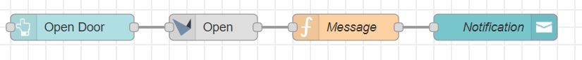

# node-red-contrib-doorbird-ultimate

[![npm-version-image]][npm-url]
[![MIT License][license-image]][license-url]

Node-Red integration for Doorbird devices.



## Disclaimer

As this library potentially interacts with devices that are integrated in the security of the building, I want you to be aware of the fact, that you are using it at your own risk. I cannot be held responsible for any damage that occurs by the usage of this library.

## Nodes

### Image

Get the current image of the camera as a byte buffer.

__Input:__

Any message will trigger the request. Payload will be ignored.

__Output:__

```json
{
    "payload": <byte buffer>
}
```

### Info

Get basic information of the Doorbird device. Includes a manual trigger and can provide additional data, such as the available relays.

__Input:__

Any message will trigger the request. Payload will be ignored.

__Output:__

```json
{
    "payload": {
        "BHA": {
            "RETURNCODE": "1",
            "VERSION": [
                {
                    "FIRMWARE": "<your firmware",
                    "BUILD_NUMBER": "<your build number>",
                    "WIFI_MAC_ADDR": "<your wifi mac address>",
                    "RELAYS": [
                        "<any active relay>"
                    ],
                    "DEVICE-TYPE": "<your device type>"
                }
            ]
        }
    }
}
```

### Light

Turns on the infrared lights for night vision.

__Input:__

Any message will trigger the lights. Payload will be ignored.

__Output:__

```json
{
    "payload": {
        "BHA": {
            "RETURNCODE": "1"
        }
    }
}
```

### Motion

Input node for motion detection events.

__Output:__

```json
{
    "payload": {
        "intercomId": "<intercom that detected motion>",
        "timestamp": "<timestamp of detection>"
    }
}
```

### Open

Open a door by enabling any of Doorbird's relays.

__Input:__

Any message will trigger the relay. Payload will be ignored.

__Output:__

```json
{
    "payload": {
        "BHA": {
            "RETURNCODE": "1"
        }
    }
}
```

### Ring

Input node for ring events.

__Output:__

```json
{
    "paylaod": {
        "intercomId": "<intercom that detected motion>",
        "event": "<for multiple ring buttons, this identifies it>",
        "timestamp": "<timestamp of detection>"
    }
}
```

### UI: Image

View an image of the camera in the node-red-dashboard.

__Input:__

Any message will trigger an update of the image.

__Output:__

The original input message will be forwarded to the output of the node.

### UI: Video

View live video of the camera in the node-red-dashboard.

[license-image]: https://img.shields.io/badge/license-MIT-blue.svg
[license-url]: https://github.com/ihrigb/node-red-contrib-doorbird-ultimate/blob/master/LICENSE
[npm-url]: https://www.npmjs.com/package/node-red-contrib-doorbird-ultimate
[npm-version-image]: https://img.shields.io/npm/v/node-red-contrib-doorbird-ultimate.svg
